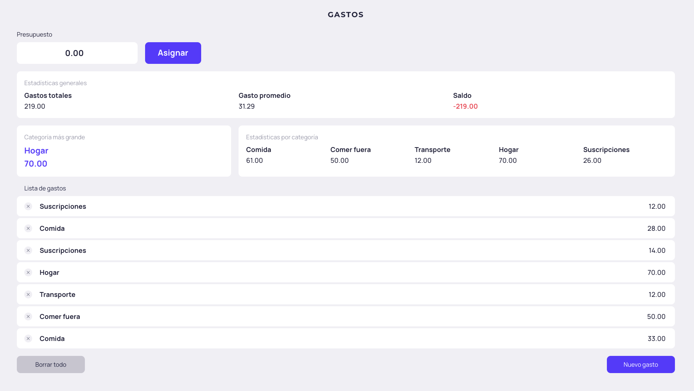

# 💰 Expense Tracker

A simple system for managing and analyzing personal expenses using JavaScript

## 🚀 Live Demo

👉 **[View Live Demo](https://ricardotrejosanjuan.github.io/web_project_expenses_es/)**

---

## 📖 Project Description

This project implements the logic of a personal expense tracker, allowing users to calculate totals, averages, balances, and category-based insights from a structured dataset.

The **main objective** is to practice **JavaScript**, efficient use of **arrays**, and functional methods, while applying **clean code principles, reusability, and proper documentation** with a real-world mindset.

---

## ✨ Features

- Calculation of the **total amount of expenses**
- Computation of the **average expense**
- Calculation of the **remaining balance** based on a defined budget
- Identification of the **category with the highest expense**
- Aggregation of expenses by **category**
- Dynamic update of the **balance visual state** (green, orange, red)
- Incremental registration of new expense entries

---

## 🛠️ Technologies

- **JavaScript (ES6+)**
  Core logic, destructuring, array methods (`push`, `length`, `reduce`, `some`)

- **JSDoc-style documentation**  
  Documentation written following the JSDoc convention to clearly describe functions, parameters, and responsibilities.

> 💡 _This project focuses business logic and structured thinking._

---

## 🚀 Future Improvements

- Migrate the project to **TypeScript**
- Extract the logic into a **reusable service or module**
- Add **unit tests**

---

## 👤 Author

| Name    | Project         | Type              |
| ------- | --------------- | ----------------- |
| Ricardo | Expense Tracker | Personal practice |
